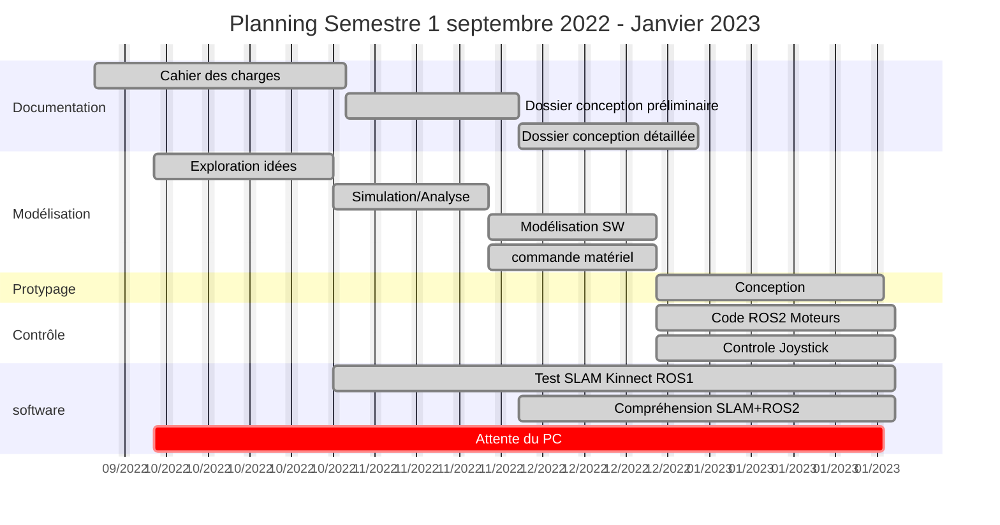
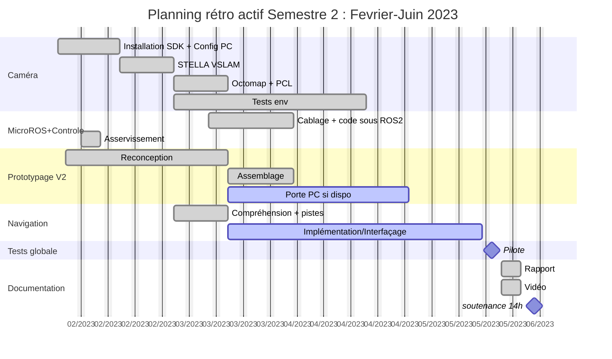
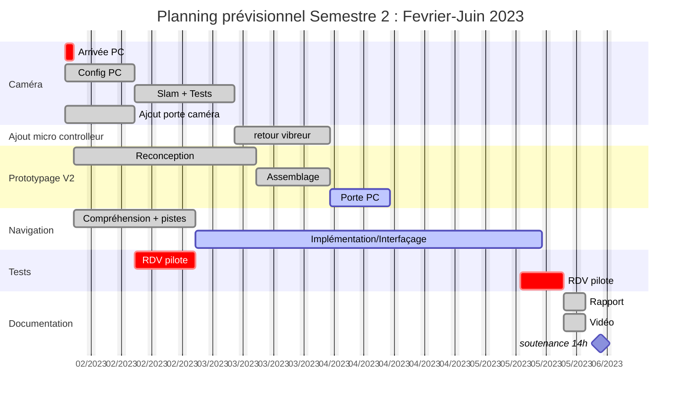

```mermaid
gantt
    dateFormat  YYYY-MM-DD
    title       Planning Semestre 1 septembre 2022 - Janvier 2023
    excludes    weekends

    axisFormat %m/%Y


    

    section Documentation

    Cahier des charges : done, doc1, 2022-09-20,2022-11-01
    Dossier conception préliminaire : done,doc2, after doc1, 2022-11-30
    Dossier conception détaillée : done, doc3,after doc2,2022-12-30

    

   
   section Modélisation
   Exploration idées :done, des1, 2022-09-30,2022-10-30
   Simulation/Analyse : done,mod1, after des1 ,20d
   Modélisation SW: done,mod2, after mod1 ,20d
   commande matériel : done,mod3, after mod1 ,20d

   section Protypage
   Conception : done, proto1, after mod3, 2023-01-30

   section Contrôle
   Code ROS2 Moteurs : done, ctrl1, after mod3, 2023-02-01
   Controle Joystick : done, ctrl2, after mod3, 2023-02-01

   section software

   Test SLAM Kinnect ROS1 : done, soft1, after des1, 2023-02-01
   Compréhension SLAM+ROS2 : done, soft2, 2022-11-30, 2023-02-01
   Attente du PC : crit, soft3, 2022-09-30, 2023-01-30

   


   


```

```mermaid


gantt
    dateFormat  YYYY-MM-DD
    title       Planning rétro actif Semestre 2 : Fevrier-Juin 2023
    excludes    weekends

    axisFormat %m/%Y


    section Caméra
    Installation SDK + Config PC : done, cam1, 2023-01-30 , 2023-02-15
    STELLA VSLAM : done,cam2, after cam1, 2023-03-01
    Octomap + PCL : done,cam3, after cam2, 2023-03-15
    Tests env : done,cam4, after cam2, 2023-04-20

    section MicroROS+Controle
    Cablage + code sous ROS2 : done, elec1, 2023-03-10, 2023-04-01
    Asservissement: done, elec2, 2023-02-05, 2023-02-10


    section Prototypage V2
    Reconception : done, proto1, 2023-02-01, 2023-03-15
    Assemblage : done, proto2, after proto1, 2023-04-01
    Porte PC si dispo : active, proto3, after proto1, 2023-05-01

    section Navigation
    Compréhension + pistes : done, nav1, 2023-03-01, 2023-03-15
    Implémentation/Interfaçage : active, nav2, after nav1, 2023-05-20
    


    section Tests globale
    Pilote : milestone, 2023-05-25
   

    section Documentation
    Rapport : done, doc1, 2023-05-25, 2023-05-30
    Vidéo : done, doc2, 2023-05-25, 2023-05-30

    soutenance 14h: milestone, 2023-06-06


```

```mermaid
gantt
    dateFormat  YYYY-MM-DD
    title       Planning prévisionnel Semestre 2 : Fevrier-Juin 2023
    excludes    weekends

    axisFormat %m/%Y


    section Caméra
    Arrivée PC : crit, cam0, 2023-01-30, 2023-02-01
    Config PC : done, cam1, 2023-01-30 , 2023-02-15
    Slam + Tests : done,cam2, after cam1, 2023-03-10
    Ajout porte caméra : done,cam3, 2023-01-30 , 2023-02-15
    
    section Ajout micro controlleur 
    retour vibreur : done, elec1, 2023-03-10, 2023-04-01


    section Prototypage V2
    Reconception : done, proto1, 2023-02-01, 2023-03-15
    Assemblage : done, proto2, after proto1, 2023-04-01
    Porte PC : active, proto3, 2023-04-01, 2023-04-15

    section Navigation
    Compréhension + pistes : done, nav1, 2023-02-01, 2023-03-01
    Implémentation/Interfaçage : active, nav2, after nav1, 2023-05-20
    
    section Tests
    RDV pilote : crit, test2, 2023-02-15, 2023-03-01
    RDV pilote : crit, test2, 2023-05-15, 2023-05-25


    section Documentation
    Rapport : done, doc1, 2023-05-25, 2023-05-30
    Vidéo : done, doc2, 2023-05-25, 2023-05-30

    soutenance 14h: milestone, 2023-06-06


 


```