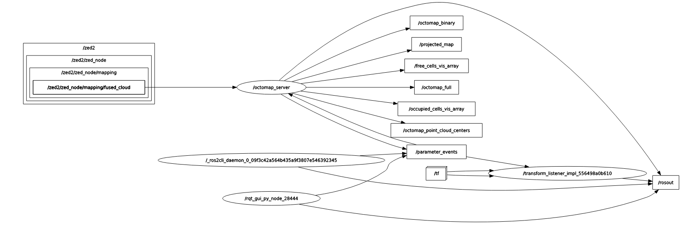

# Projet Cybathlon 2024: prise en main des ressources

Le Cybathlon-VIS est une compétition scientifique et technologique, au cours de laquelle des personnes en situation de handicap vont participer à des épreuves, le tout accompagné d’une équipe de scientifiques, démontrant ainsi l’apport des technologies pour les personnes handicapées. En 2024 se tiendra la prochaine édition de la compétition. Pour la première fois, une série d'épreuves est organisée pour des compétiteurs malvoyants/non voyants.  Notre projet est de développer une technologie permettant de répondre aux objectifs de la compétition pour remplir les objectifs de l'épreuve.

[Cybathlon VIS 2024](https://cybathlon.ethz.ch/en/event/disciplines/vis)

Les règles sont spécifiés au lien [Cybathlon rules](https://cybathlon.ethz.ch/documents/races-and-rules/CYBATHLON%202024/CYBATHLON_RacesAndRules_2024.pdf)


Nous nous concentrons sur l'épreuve de la piste jonchée d'obstacles ci-dessous visible.


Différents obstacles seront placés sur une piste de 3* 5mètres. Notre projet consiste a développer une architecture mécanique et logicielle capable de guider de manière kinésthésique un pilote non voyant, qui pourra être préalablement entrainé.


Ce projet a été mené en équipe de 4 étudiants, et encadrés par nos professeurs et chercheurs de l'[ISIR](https://www.isir.upmc.fr/) et de [Polytech Sorbonne](https://www.polytech.sorbonne-universite.fr/formations/robotique). Il s'agit d'un projet d'une durée d'un an, durant l'année scolaire 2022/2023.


#  Cahier des charges

Nous avons élaborer un cahier des charges reprenant toutes nos contraintes, et toutes les attentes vis a vis de ce projet. Il est disponible sous format pdf dans le dossier __Documentation__. 
On trouvera également dans ce dossier une explication pdf de nos plans et idées préliminaires, nos schémas, calculs et simulation.

# CAO et simulation

Le git contient un dossier __CAO SolidWorks__ contenant :

* Nos modélisations de toute l'architecture mécanique

* Leurs mises en plan norme ISO

* Une doc technique du matériel et outils utilisés

A ce stade, deux prototypes ont été réalisés au [Fablab de Sorbonne Universite](https://fablab.sorbonne-universite.fr/) ainsi qu'a l'atelier de Polytech.


La documentation, et en particulier le dossier de conception détaillé, reprend de manière précise les étapes de conception.

## Simulation de l'espace de travail du pantographe


Nous avons implémenté le modèle géométrique direct du pantographe, ainsi que son espace de travail, sous Matlab. Il est disponible dans le dossier __Simulation__.
 

Il permet de visualiser dans un plan 2D l'espace de travail, et dans une 3e dimension, on peut voir le couple demandé sur l'actionneur en question. Quelques points sont abbérants et ont été coupés.

**Remarque**

Le modèle géométrique direct est une approximation du modèle réel. En effet, il ne prend pas en compte les frottements, les jeux mécaniques, les pertes de puissance, etc. Il est donc nécessaire de prendre en compte ces paramètres dans la réalisation du pantographe.

De plus, la force réelle du pilote a été volontairement surévaluée.

Il est possible de changer les paramètres des longueurs des bielles au début du code, et voir les répercussions sur l'espace de travail.

# Architecture logicielle


L'algorithme du projet repose sur une architecture de briques, utilisables sous ROS2 Humble. 

Ce dossier contient plusieurs workspaces ROS2 : 

* Le workspace pour le wrapper de la caméra
* Un workspace pour lancer Octomap / la Naviguation
* Un workspace pour le controle des moteurs.


## Installation du wrapper de la caméra

Cette partie vise à décrire les étapes d’installations des paquets et dépendances 
nécessaires à l'utilisation de la caméra sous ROS2.


### Prérequis 

* Ubuntu 22.04
* ROS2 Humble
* Un ordinateur avec une carte graphique NVIDIA

Il est nécessaire d’installer plusieurs dépendances, avant de pouvoir utiliser la caméra via ROS2.

* CUDA : [ version 11.8 et toutes ses dépendances](https://developer.nvidia.com/cuda-downloads)
*ZED SDK v4.0 via [ZED2](https://www.stereolabs.com/developers/release/)

**Remarque** :
1-Attention aux versions d’openCV utilisées. En effet, les dernières versions peuvent ne pas être compatibles avec CUDA. Se renseigner sur le site de CUDA.

2- L’installation peut prendre un certain temps

### Utilisation sous ROS2

Dans le cadre de ce projet, nous utilisons ROS2 afin de pouvoir communiquer le résultat de l’algorithme de mapping, le SLAM, via des topics ROS2, et de pouvoir en exploiter le résultat.

  

Le SDK de la caméra fournit un fichier lançant le noeud de la caméra , et permettant de démarrer tous les topics disponibles.

  

Une fois le wrapper installé dans le fichier source, et le paquet compilé via

```$ colcon build --symlink-install --cmake-args=-DCMAKE_BUILD_TYPE=Release   ```

Exécuter la commande :

```$ ros2 launch zed_wrapper zed.launch.py ```

Cette première commande lance tous les noeuds et topic liés a la caméra, notamment le topic d'odométrie et du nuage de points via la SLAM.

### Paramètres
Dans le SDK de la ZED2 se trouve un fichier, commun a tous types de ZED, avec des paramètres internes. Voici son chemin :

``zed-ros2-wrapper/zed wrapper/config/common.yaml ``

Dans ce fichier, on peut regler plusieurs paramètres qui peuvent nous interesser.


* mapping_enabled doit être mis a True pour permettre le SLAM

* initial_base pose permet de definir la position de démarrage de la caméra : par défaut, a l'allumage, la caméra est a (0,0,0).

* depth_min_range : il s'agit de la distance minimale a laquelle la camera essayera de detecter un objet. Cela peut etre utile si on ne veux pas que le bout du pantographe soit compté comme un obstacle ! Par défaut , même si on la met a 0, la caméra ne peut techniquement pas detecter a moins de 30 centimètres.


    
    


### Tests et Comparaison : choix des modes

La ZED2 possède 4 modes. Nous choisissons le mode NEURAL #4.

Attention : 

* Il est nécessaire de l'entrainer une première fois au démarrage

* Il s'agit du mode le plus gourmand : voir [Depth modes](https://www.stereolabs.com/docs/depth-sensing/depth-settings/). Il peut doncêtre utile dans les paramètres du wrapper de spécifier une plus grande taille mémoire en % alloué.

Ce mode nous est pertinent car du au réseau neuronal employé, il est bien plus performant pour reconstituer des objets/obstacles.
La qualité du point cloud est sensiblement meilleure que les 3 autres, avec plus de points, donc plus de précisions.


**Remarque**

La bouteille fait partie des obstacles a éviter lors de l'épreuve. On suppose qu'elle est transparente et contient de l'eau. Selon les conditions d'éclairement , elle peut ainsi être difficilement perçue.


## Installation de OCTOMAP

Suivre le tutoriel : [Octomap](https://github.com/OctoMap/octomap)  
Il s'agit d'une librairie qui prend en entrée message ROS2 ``sensor_msgs/PointCloud2 Message``, filtre le nuage de points, et le projette sur un plan 2D , donnant une occupancy grid.


Pour lancer le noeud ``octomap_server`` :

 ``ros2 launch octomap_server octomap_mapping.launch.xml``

Les topics interessants :

* octomap_point_cloud_centers : centre de chaque voxel.
* map : resultat de la projection sur un plan 2D. Le résultat est de type ``nav_msgs/OccupancyGrid``. autre nom : projected_map.

#### fichier xml de lancement

Il est nécessaire dans le fichier xml, situé dans ``octomap_mapping/octomap_server/octomap_mapping.launch.xml`` de spécifier le nom du topic ou se situe le nuage de points (message ROS2). Ainsi, il faudra changer s'il faut la ligne

``<remap from="cloud_in" to="/zed2/zed_node/mapping/fused_cloud"/>``

Ces 2 lignes servent a cropper en Z (verticale vers le haut) le nuage de point d'octomap. Il peut être changé en fonction de la luminosité et du volume des obstacles traités :

``<param name="occupancy_min_z" value="0.2"/> ``
``<param name="occupancy_max_z" value="1.8"/>``


Enfin , ``<param name="filter_speckles" value="true"/>`` sert a préfiltrer l'octree, en elevant les points isolés.


### Sauvegarde de l'occupancy grid (2D)

dans le fichier ``map_result_Cybathlon`` se trouve une sauvegarde de l'occupancy grid et de l'octree. On peut sauvegarder en executant les commandes :

``ros2 run nav2_map_server map_saver_cli -f path``

 et 

 `` ros2 run octomap_server octomap_saver_node --ros-args -p octomap_path:=my_house.ot``


 

 ## Resultat et observation sous Rviz2

  


Au commencement, on suppose que le pilote est au milieu de la piste, orienté face a la ligne d'arrivée. Les zones inconnues , non vues par la caméra, sont supposées libre (pixel a 0).
Des délimations manuelles sont mises, afin de délimiter l'espace de l'occupancy grid : on rappelle qu'il s'agit d'une piste de 3*5m.


**Important**

Il est possible manuellement dans les paramètres de la zed de spécifier que l'on démarre a une hauteur z du sol. Notre caméra etant placé sur la tête du pilote, il nous aurait fallu spécifier la taille du pilote. Cependant , pour des raisons inconnues, en spécifiant une valeur, on constate lors des essais, que le nuage de point a tendance a se pencher. Pour cela, nous avons fait le choix de démarrer a 0, ce qui nous évite temporairement ce problème. Il faut donc absolument que le pilote démarre avec la caméra posée a terre, et au milieu de la piste.


### Navigation

L'objectif de la navigation est d'obtenir une direction que le pilote devra suivre afin d'arriver à la position souhaitée. Nous recevons en entrée une occupancyGrid de Octomap correspondant à un tableau une dimension avec la probabilité que chaque pixel contienne un obstacle. Si l'obstacle est confirmé la valeur 100 est assignée à ce pixel, si on sait que la zone est vide nous aurons une valeur de 0 et si le pixel n'est pas encore déterminé une valeur de -1 est définie.

Connaissant la position des obstacles il ne reste plus qu'à obtenir un chemin pour parcourir le graphe et atteindre l'arrivée. Ceci est réalisé grâce à un algorithme de navigation nous renvoyant une direction optimal à suivre que nous pouvons envoyer aux moteurs afin de guider le pilote.


 


## Algorithme Dijkstra : 
**Fonctionnement :** 

On délimite un rayon autour de la position initiale et nous parcourons tous les points du cercle. Tant que le point d'arrivée n'est pas atteint, le rayon de notre cercle augmente pour rechercher des intersections de plus en plus loin de notre point de départ.

**Incovéviant :**

Si on connait la position de notre point d'arrivée nous perdons un temps assez important afin de trouver un chemin optimal.
C'est pour cela que nous utilisons l'Algorithme A*.

## Algorithme A*

**Fonctionnement :**

A* est une extension de l'algorithme Dijkstra plus performante et optimal pour trouver un chemin, en effet connaissant la position de départ et la position finale, le chemin le plus court pour atteindre la destination est la ligne droite.
L'algorithme va donc parcourir le graphe en se dirigeant directement vers la position à atteindre.


 


**Avantages :**

* Consomme très peu de mémoire
* Plus rapide pour calculer un chemin que l'Algorithme Dijkstra.

**Inconvénients :**

* Si la position a atteindre est sur un obstacle il est impossible de trouver un chemin afin d'atteindre la position souhaitée
* Si le chemin optimal pour atteindre la position finale n'est pas dirigé vers la position finale mais à l'opposé il sera un peu plus long pour calculer la trajectoire. Cependant, comme nous savons par avance qu'au maximum 10 obstacles seront présents sur la piste, nous supposons que ce cas se présentera rarement et que nous privilégions un temps de parcours plus court pour les cas les plus fréquents.


 


# Utilisation sous ROS2
Afin de lancer cet algorithme sous ROS2 nous utilisons la ligne de commande : 

```ros2 run navigation_py dijkstra_node```


De plus, nous pouvons utiliser l'algorithme de traduction de l'information grâce à la commande :
	
	
```ros2 run navigation_py direction_node_ss_bool```
	
Cet algorithme prend en entrée l'angle obtenu par l'algorithme a* et envoie une position à atteindre aux moteurs pour guider le pilote dans la direction souhaitée. L'information sera ensuite reçu par une nouvelle node que l'on peut lancer avec :

	
```ros2 run pyxbox commande_moteur```


### microROS

MicroROS est un moyen de communication entre un microcontrolleur et ROS2. Nous l'utilisons pour transmettre certaines informations au pilote telle que la position d'origine. Cela peut lui permettre d'avoir un point de repère fixe, pour cela nous implémentons un vibreur sur la poignée du pantographe qui s'activera lorsque la poignée est à la position d'origine.

**Installation :**

L'installation de microROS peut être compliqué lorsque Nav2 est déjà installé sur l'ordinateur. 
3 lignes de commandes sont nécessaires afin de faire l'installation :


```git clone -b $ROS_DISTRO https://github.com/micro-ROS/micro_ros_setp.git src/micro_ros_setup```

```sudo apt update && rosdep update```

```rosdep install --from-path src --ignore-src -y```


**Prérequis :**

* Microcontrolleur ESP32.

**Avantages :**

Si le pilote perd l'information sur la direction, il sera en mesure de la retrouver par un passage à l'origine.

**Inconvénients :**

Nous avons pu remarquer un léger retard lorsque le vibreur s'active pour la position d'origine.
De plus, nous avons pu remarquer que nous ne pouvons pas travailler avec des informations analogiques avec microROS, seulement le numérique est supporté pour le moment. 

**Utilisation :**

6 commandes sont nécessaires afin de pouvoir lancer le code microROS, ces 6 commandes se lancent depuis le même terminal :

```ros2 run micro_ros_setup configure_firmware.sh microROS_sub --transport serial```

```ros2 run micro_ros_setup build_firmware.sh```

```ros2 run micro_ros_setup flash_firmware.sh```

```ros2 run micro_ros_setup create_agent_ws.sh```

```ros2 run micro_ros_setup build_agent.sh```

```ros2 run micro_ros_agent micro_ros_agent serial --dev /dev/ttyUSB```


Ce code n'est pas encore implémenté dans le code final du projet, cependant il est tout à fait possible de tester son fonctionnement en lui envoyant une information directement depuis un second terminal afin d'activer le vibreur :

```ros2 topic pub --once/micrROS std_msgs/msg/Int32 '{data: 1}'```


## Prise en main du package controle des moteurs

* Les moteurs sont des Dynamixel MX-28R (Protocol 2.0)


## Installation de la SDK de Dynamixel

Cette partie vise à décrire les étapes d’installations des paquets 
nécessaires à l'utilisation des moteurs sous ROS2.

### Prérequis 

* Ubuntu 22.04
* ROS2 Humble

### Installation

Vous n'avez pas d'installation a effectué, juste à mettre notre package dans le src : DynamixelSDK (Moteur) et pyxbox (Contrôle via la manette/Algorithme)

Si vous faites une installation sans prendre nos packages
* Dynamixel SDK : [Installer via le site](https://emanual.robotis.com/docs/en/software/dynamixel/dynamixel_sdk/download/#repository)
Package à installer dans le src du workspace de ROS2

Installation de l'interface
* Dynamixel Wizard 2.0 : [Installer via le site](https://emanual.robotis.com/docs/en/software/dynamixel/dynamixel_wizard2/)
Aller à la partie "Software Installation" et suivre les étapes.

### Utilisation de Wizard

* Pour pouvoir voir ses moteurs dans l'interface, il faut tout d'abord scannez ces derniers. Dans l'onglet "Options" : vous pouvez choisir un Scan des ID de 0 à 2 pour faciliter la rapidité d'exécution (Nous avons mis manuellement les ID 1 et 2). Ne pas oublier de sélectionner le port pour les moteurs (Select All pour plus de simplicité).
* Vous pouvez allumer la Led d'une des moteurs pour savoir quel moteur correspond à quel ID. Le torque permet d'allumer l'asservissement des moteurs.
* Si vous recherchez plus d'informations pour l'interface, vous pouvez checker le site de Dynamixel Wizard. Vous pouvez aussi checkez ce site : [Site spécifique des moteurs](https://emanual.robotis.com/docs/en/dxl/mx/mx-28-2/)

### Utilisation sous ROS2

Dans le cadre de ce projet, nous utilisons ROS2 afin de pouvoir controler les moteurs.

Nous avons un paquet permettant le mode manuel, c'est-à-dire le contrôle extérieur depuis une manette de jeu xBOX. Les commandes ci-dessous précisent comment lancer les noeuds.

Une fois la mise en place des packages dans le src, il faut compiler via la commande :

``` $ colcon build ```

* Pour lancer les moteurs :

Avant de lancer les moteurs, n'oubliez pas de mettre le bouton ON sur la carte de commande 

```$ ros2 run dynamixel_sdk_examples d_node ```

Il se peut que le code vous renvoie une erreur :
* Soit vous avez oublié de disconnect les moteurs sur Wizard
* Soit il faut changer le port USB dans le code d_node.cpp

C'est à la ligne 54 qui se trouve dans le path "src/DynamixelSDK/dynamixel_sdk_examples/src/d_node.cpp


* Pour lancer la manette :


        Brancher l'adaptateur au PC
        Appuyez sur le bouton de l'adaptateur jusqu'a ce qu'il clignote
        Appuyez sur le bouton central de la manette Xbox
        Appuyez sur le bouton à côté de la touche "LB" jusqu'à ce que l'adaptateur arrête de clignoter

Effectuez ces 2 commandes pour que le PC soit connecté à la manette : 

```$ sudo chmod -R 777 /dev/bus/usb/ ```
``` $ xboxdrv --no-uinput --detach-kernel-driver ```

Vous pouvez faire CTRL+C une fois que c'est bon

Avant toute chose, il faut être sur que la manette est bien connectée, pour cela, vous pouvez lancer un script python qui se trouve dans le path "src/pyxbox/pyxbox/sample.py"
Il faut que Connected affiche un Y et non N !

``` python3 sample.py ```

Il faut bouger le joystick et les valeurs changent.


Ligne de code pour lancer la node de la manette :

```$ ros2 run pyxbox manette_moteur ```

Il se peut que la manette ne fait pas bouger le robot :
* Soit la manette n'est pas connectée
* Soit les moteurs ont des valeurs aberrantes au lancement, il faut alors relancer les moteurs en appuyant sur OFF sur la carte de commande et refaire la manipulation de ces derniers.
